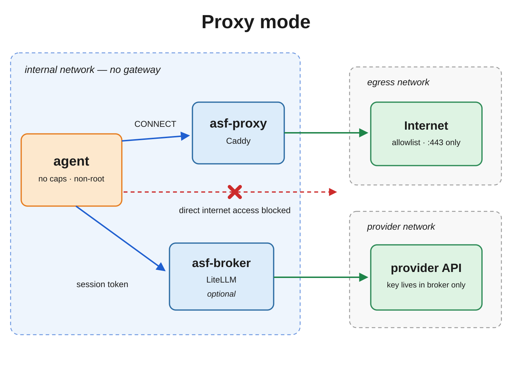
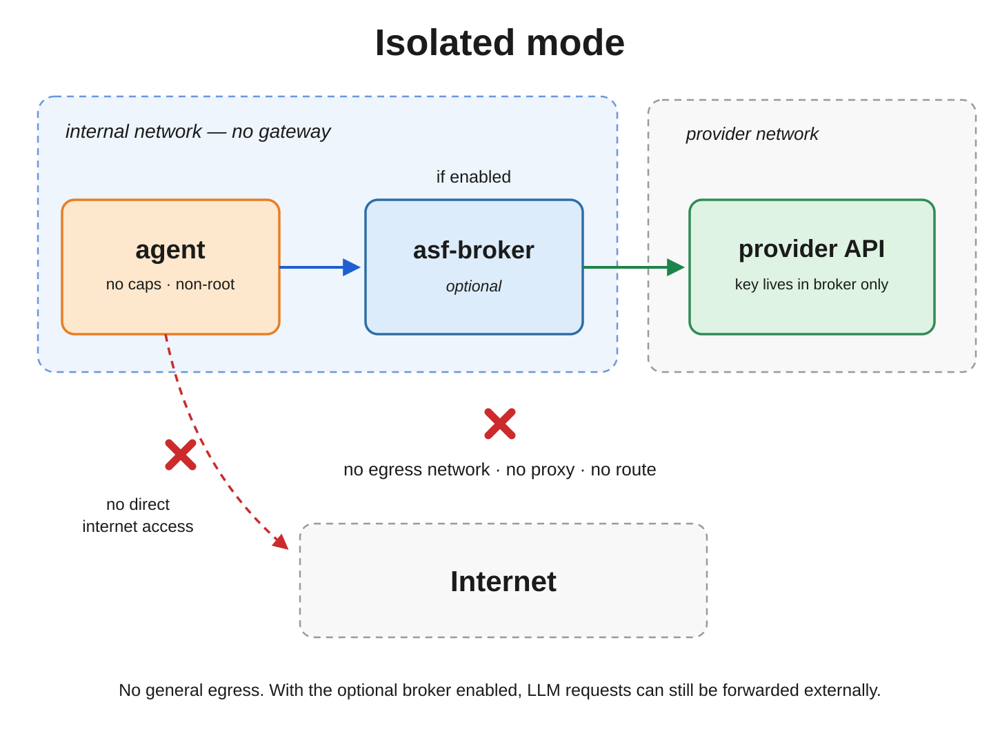
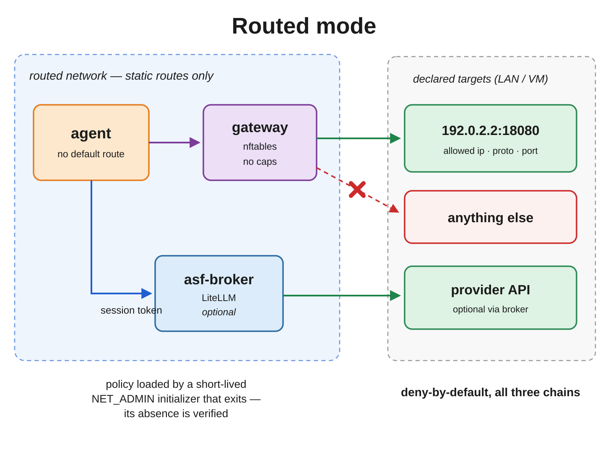

# Security model

This document describes ASF's defense-in-depth controls and important
limitations. For the concise trust boundary and threat-model summary, start with
[TRUST.md](TRUST.md).

## Security model — what each layer does

Defense in depth, from outside in:

1. **Runtime boundary.** The host filesystem is not generally exposed to the
   agent. The default backend is a normal container; `runtime.isolation:
   microvm` runs the agent workload under libkrun/KVM while the VMM remains in
   the surrounding rootless Podman runtime. ASF always mounts its own checkout
   read-only at `/workspace/sandbox` (with `/workspace/sandbox/secrets` shadowed
   by an empty read-only tmpfs), then adds only repositories listed in
   `agents/<name>/repos.yml` and declared named volumes. Repository entries may
   be `rw` or `ro`.
2. **Rootless engine.** Podman runs as your unprivileged user; there is no root
   daemon. A container escape yields only your existing user privileges.
3. **Non-root agent, no capabilities.** Agent-controlled work runs as `node`
   with `--cap-drop=ALL`, `no-new-privileges`, and **no `sudo` at all** — there
   is no sudoers rule, because nothing inside needs privilege. The krun guest
   bootstrap enforces the same agent identity and capability state inside the
   microVM.
4. **Network topology.** The agent joins one `--internal` network, which has no
   gateway. It cannot reach the internet directly; there is no route to filter.
   All egress goes through a Caddy proxy container that allows only the domains
   a runtime declares in its manifest — there is no implicit base list — and
   only port 443, on both the `CONNECT` and plain-HTTP paths. SSH is tunnelled
   via `ssh.github.com:443`. The
   proxy config is generated, never hand-written. Before the agent starts, ASF
   verifies from a throwaway container that an allowlisted host is reachable, a
   non-allowlisted one is not, and no route bypasses the proxy — a failure
   aborts the session (fail closed). See [EGRESS-DESIGN.md](EGRESS-DESIGN.md).
5. **Permission rules** (`.claude/settings.json`). Claude Code's permission system
   asks before commits, pushes, and dependency installs; denies destructive
   patterns outright.
6. **Pre-tool-use hook** (`pretooluse-guard.sh`). Defense in depth on top of (5).
   Uses regex on the literal command string and **can be bypassed** with command
   substitution, variable expansion, or splitting commands across files. It
   catches honest mistakes, not determined adversaries. The real boundary is
   layers 1–4. When the hook has no opinion it emits nothing, deferring to the
   permission rules in (5) — it never auto-approves (an approve decision from a
   PreToolUse hook would bypass the permission system and disable every `ask`
   rule).

## Container hardening (asf.conf)

Resource and capability limits are applied as Podman run-args from
`asf.conf` (all on by default, documented, edit and re-open — no rebuild).
Adapted from the wnstify Hermes sandbox:

- `cap-drop=ALL` by default; only manifest-declared `NET_RAW` may be added for
  workloads such as SYN scanning. `NET_ADMIN` is never permitted in a runtime
- `pids-limit`, `memory`, `cpus` — DoS / runaway protection
- `ulimit core=0` — no core dumps, so in-memory secrets never hit disk
- `tmpfs /tmp,/run` with `nosuid,nodev` — dropped binaries there can't escalate
- `ipc=private` — no shared-memory leakage

Separately from these tunable options, `/workspace/sandbox/secrets` is always
masked by an empty read-only tmpfs. It is a framework invariant, not controlled
by `EXTENDED_HARDENING_ENABLED` or `TMPFS_ENABLED`.

`no-new-privileges` is **on**. Earlier versions had to disable it because the
in-container firewall ran through `sudo`; moving enforcement out removed that
constraint along with the sudo rule and all nine capabilities.

### Seccomp by isolation backend

ASF does not maintain a custom seccomp profile. The backend semantics differ:

- **`container`** — the agent runs under the host kernel and inherits Podman's
  default OCI seccomp filter. The accepted runtime baseline is a non-root agent
  with empty capability sets, `NoNewPrivs: 1`, `Seccomp: 2`, and at least one
  active seccomp filter.
- **`microvm`** — `/proc` inside the guest describes the guest kernel. The
  non-root agent still has empty capability sets and `NoNewPrivs: 1`, but ASF
  does not currently install a guest seccomp filter, so guest processes report
  `Seccomp: 0`. This does not describe the host-side VMM. The krun VMM is
  started through the same rootless Podman hardening path; host-side acceptance
  verified it as non-root, capability-less, `NoNewPrivs: 1`, seccomp-filtered,
  and isolated from the host shell by its Podman namespaces.

ASF does not add guest seccomp merely to make both backends report the same
`/proc` state. With krun, the guest kernel/KVM boundary separates agent syscalls
from the host kernel, while the host-side VMM remains subject to the surrounding
Podman controls. Seccomp is defense in depth, not an authoritative ASF policy
boundary. See [KRUN.md](KRUN.md) for the microVM-specific boundary.

## Repository metadata and host Git

A repository mounted `rw` is writable in full, including its `.git` directory.
An untrusted agent can therefore modify Git configuration, hooks, remotes, and
other repository metadata that may influence later Git commands on the host.
Do not treat host-side `git log`, `git diff`, `git push`, or similar commands as
a security boundary after an untrusted session. Review the repository before
executing host Git commands. Protecting `.git` while keeping the working tree
writable is tracked as a known security limitation.

## Runtime credentials

Values loaded from ASF secret files are injected only into workload `podman exec`
processes for container isolation; they are not stored in the container config
and their values are not placed in argv. The LiteLLM broker session token is a
deliberate exception: it is session-scoped and is persisted in the runtime
container environment so later shell processes can authenticate to that session's
broker without persisting a reusable provider credential. Provider API keys
remain outside the brokered agent runtime.

## Hermes-specific hardening

`./sandbox.sh open hermes` applies these automatically:

- **`HERMES_WRITE_SAFE_ROOT=/workspace/repos:/home/node/.hermes`** — hard
  write-jail. `write_file`/`patch` outside these roots are rejected outright,
  no prompt. The agent cannot write to sandbox config, `/etc`, or anywhere else.
- **`HERMES_YOLO_MODE=0`** — approval-bypass **defaulted** off. Note: this sets
  the initial state only; the operator can still enable it at runtime with
  `/yolo`, which bypasses approvals and the Tirith gate. The agent cannot enable
  it (`/yolo` is a user command, not a tool), and the container boundary still
  applies, but treat YOLO as an operator footgun, not a hard lock.
- **`HERMES_REDACT_SECRETS=true`** — key patterns scrubbed from output/logs.
- **Tirith command scanning** — the Hermes image contains a pinned,
  checksum-verified Tirith binary at `/usr/local/bin/tirith`; Hermes selects it
  by absolute path and runs it offline. ASF keeps `tirith_fail_open: false` and
  applies a narrow compatibility patch so Hermes's circuit breaker honors that
  setting. Tirith remains defense in depth, not an ASF sandbox boundary.
- From `config.yaml`: `approvals.mode: manual`, `allow_private_urls: false`
  (SSRF protection), `allow_lazy_installs: false`, `guard_agent_created: true`.

## Network modes

A runtime declares how it reaches anything outside itself:

```yaml
network:
  mode: proxy | isolated | routed
```

**`proxy`** (default) — egress through Caddy to the domains the manifest
declares, port 443 only, on both request paths. `allow_domains` is the complete
list; there is no implicit base set.

<p align="center">
  
</p>

**`isolated`** — no proxy and no egress network. The runtime has **no direct
external path**.

> `isolated` does not mean offline. The runtime can still reach services on its
> private internal network, especially LiteLLM, and the broker forwards to an
> external provider on its own network. Logical agents inside one application
> still share the same container. Separate ASF runtimes are not connected by
> default. Data can therefore still leave through the broker.

<p align="center">
  
</p>

**`routed`** — exact IPv4 CIDR/protocol/port access through a separate
nftables gateway. The runtime receives only declared static routes, never a
default route. The long-lived gateway has no capabilities; a short-lived
`NET_ADMIN` initializer loads policy and exits. ASF explicitly verifies its
absence and re-inspects the capability-less holder before startup succeeds.
Startup requires a reachable
allowed TCP control and a second known-open port that policy must block.

<p align="center">
  
</p>

> **Topology note:** a routed runtime also keeps its separate private internal
> service-network attachment. If LiteLLM is enabled, the runtime reaches the
> broker on that internal network; broker traffic does not traverse the nftables
> gateway.

All modes are verified before the agent container starts. Every **deny**
check is fatal: a policy that fails to block aborts the session. The
**positive control** (an allowlisted host being reachable) is an availability
check, not a security property: if it fails *inconclusively* — upstream down,
5xx — startup continues with an explicit warning, while an outright proxy
denial of an allowlisted host still aborts as a policy misconfiguration. The
full check-by-check verdict is persisted to
`${XDG_STATE_HOME:-$HOME/.local/state}/asf/<checkout-id>/sessions/<agent>/runs/<session-id>/verification-report.json`. Routed startup
exercises TCP end to end; UDP and ICMP rules retain unit coverage. See `agents/isolated-worker/runtime.yml`,
`agents/routed-scanner/example-runtime-ci-tested.yml`, and [TESTING.md](TESTING.md).

### Evidence-driven allowlist review

With `CADDY_ACCESS_LOGS=true`, every proxy session writes bounded JSON access
logs into its own evidence directory. Teardown reduces those logs to counts;
ASF startup-verification probes are tagged and excluded from the result.

```bash
./sandbox.sh advise claude
```

Example:

```text
Egress policy advice for claude (12 recorded sessions; window 12)
  - sentry.io was allowlisted but unused in your last 12 sessions — consider removing it.
  - The agent attempted 47 denied CONNECTs to registry.npmjs.org across 12 sessions — consider adding it.
```

Removal advice requires 12 completed sessions in which the domain was present
in the effective allowlist and never contacted. Addition advice requires at
least three denied CONNECTs across at least two sessions. These conservative
thresholds avoid turning one typo or one unusual run into a policy change.
Advice is read-only and available after the session has stopped; edit
`agents/<agent>/runtime.yml` yourself after reviewing the destination.
## Known limitations

Documented gaps, not oversights. Each is a deliberate trade-off:

- **DNS tunnelling through the legitimate resolver.** Port 53 is restricted to
  the container's configured resolvers, which closes direct connections to
  arbitrary hosts — but a low-bandwidth channel through the recursive resolver
  itself remains.
- **CDN-shared IPs widen effective egress.** Filtering is IP-based and HTTPS
  routing is SNI-based. Allowlisting domains served from shared CDN edges
  (e.g. Cloudflare, Fastly, Azure blob frontends) allows every other domain
  behind the same IPs. Port-constraining outbound to 80/443 shrinks this to
  web traffic, but does not remove it.
- **IPs are resolved once at container start.** CDN rotation during long
  sessions can break allowlisted services until the container is restarted.
- **Runtime environment confidentiality is still host-scoped.** In container
  isolation values loaded from ASF secret files are supplied only to workload
  and shell `podman exec` processes: ASF passes `--env NAME` and provides the
  value through the Podman process environment, so those values are neither in
  the generated command line nor the persistent container configuration.
  microVM launch uses the same name-only Podman boundary for the guest
  environment. The same host user or root can still inspect process state. The
  LiteLLM broker additionally keeps the reusable provider credential out of the
  agent workload.
